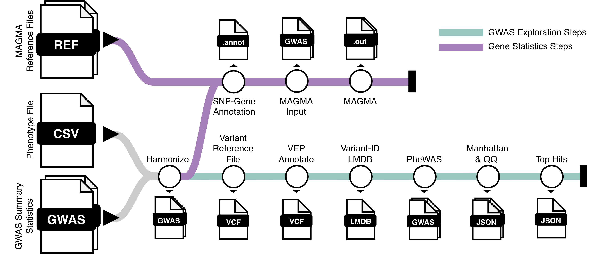

# Nextflow Preprocessing Pipeline for DyHealthNet Light Platform

Data preprocessing for the DyHealthNet Light platform is performed through a Nextflow-based pipeline that enables seamless deployment across different computing environments and automatically ensures scalability for large collections of GWAS summary statistics. 

The pipeline provides comprehensive functionality for preparing GWAS summary data for integration into the DyHealthNet Light platform, including data harmonization, variant annotation using the Ensembl Variant Effect Predictor, and, optionally, the execution of gene-based association analyses with the state-of-the-art tool MAGMA.




# Preparation

To start, clone the repository:

```{bash}
git clone https://github.com/DyHealthNet/dyhealthnetlight_nf_pipeline.git
```

## Installations

Execution of the pipeline requires the installation of Java and Nextflow. Depending on the compute environment you select, either Conda, Docker or Singularity have to be installed.

Details on how to install Java and Nextflow can be found here: https://www.nextflow.io/docs/latest/install.html.

## Download Reference Files

For running MAGMA, appropriate reference data are required. The 1000 Genomes Project is commonly employed as the reference population.

The reference data used in this study are publicly available on Zenodo (\href{https://doi.org/10.5281/zenodo.17530575}{10.5281/zenodo.17530575}). Additional reference datasets, including Ensembl-based gene location files, can be obtained from the FUMA repository (\url{https://fuma.ctglab.nl/downloadPage}).

We rely on these reference files because they use variant identifiers of the form chr:pos:alleles, which are independent of dbSNP releases, ensuring consistency across genome builds.

After downloading, the corresponding paths to the reference files should be updated in the nextflow.config file.

## Prepare Your Data

The primary input to the preprocessing pipeline is a CSV/TSV file containing the phenotypes and their corresponding GWAS summary statistics file locations.  
Each row represents one phenotype, with the following columns:

| **Column** | **Description** |
|-------------|-----------------|
| `phenocode`  | Unique identifier of the phenotype or trait analyzed in the corresponding GWAS summary statistics file. |
| `filename` | **Absolute** path to the GWAS summary statistics file associated with the phenotype. |
| `nr_samples` | Number of samples included in the GWAS for the respective phenotype, used for downstream analyses such as MAGMA gene-based testing. |

These column names are mandatroy, while additional columns may be included.


## Fill the Nextflow Config Files

Study-specific parameters must be defined in the configuration file configs/study_specific.config.

Computational settings such as memory allocation, runtime limits, and other scheduler-related parameters should be specified in configs/compute_slurm.config.

In addition, a general configuration file configs/base.config is provided to adjust parameters related to Manhattan and top hits generation as well as VEP window distances. These parameters are preconfigured with suitable defaults and typically do not require manual modification.


### Study-Specific Config

| **Parameter** | **Example Value** | **Description** |
|----------------|-----------------------------|-----------------|
| `pheno_file` | `NA` | Path to the phenotype configuration file containing trait names and corresponding GWAS summary statistic file paths. |
| `base_dir` | `NA` | Path to the base directory containing the GWAS summary statistic files (for docker and singularity volume). |
| `out_dir` | `NA` | Output directory where all processed results and intermediate files will be stored. |
| `pheno_batch_size` | `5` | Number of phenotypes processed in parallel within a single batch. |
| `steps` | `["gene_statistics", "gwas_exploration"]` | List of workflow steps to be executed (e.g., gene-based statistics, exploratory analysis). |
| `chr_column` | `3` | Column index (1-based) of the chromosome field in the GWAS summary statistics file. |
| `pos_column` | `4` | Column index of the variant position field. |
| `ref_column` | `5` | Column index of the reference allele field. |
| `alt_column` | `6` | Column index of the alternate allele field. |
| `pval_column` | `16` | Column index of the p-value field. |
| `beta_column` | `9` | Column index of the effect size (beta) field. |
| `se_column` | `10` | Column index of the standard error field. |
| `af_column` | `8` | Column index of the allele frequency field. |
| `pval_neglog10` | `false` | Indicates whether p-values are stored as negative log10 values (`true`) or raw p-values (`false`). |
| `ensemblvep_species` | `'homo_sapiens'` | Species identifier for Ensembl VEP annotation. |
| `ensemblvep_genome` | `'GRCh37'` | Genome assembly version used for annotation. |
| `ensemblvep_cache_version` | `110` | Version of the Ensembl VEP cache used during annotation. Must match the installed VEP version. |
| `ensemblvep_cache` | `NA` | **Optional**. Path to pre-existing VEP cache. If no cache existing, cache will be downloaded automatically. |
| `magma_reference_plink` | `NA` | Path to the PLINK reference panel used by MAGMA for gene-based analyses. |
| `magma_window_up` | `10` | Upstream window size (in kb) used when mapping variants to genes in MAGMA. |
| `magma_window_down` | `10` | Downstream window size (in kb) used when mapping variants to genes in MAGMA. |
| `magma_gene_location` | `NA` | Path to the Ensembl gene location file used for MAGMA analyses. |

**Note**: Environment files are provided for VEP versions 110, 114, and 115. The VEP version installed in Conda must correspond to the VEP cache version. If a different VEP version is required (e.g., to match an existing VEP cache), an additional environment file named vep_X.yml should be created, where X denotes the desired VEP version.

### Compute Config

| **Parameter** | **Example / Default Value** | **Description** |
|----------------|-----------------------------|-----------------|
| `slurm_queue` | `slow-mc2` | Defines the SLURM queue to be used when profile = slurm. |
| `global_maxForks` | `10` | Defines the global maximum number of processes that can run in parallel across the workflow. |
| `normalize_cpus` | `12` | Number of CPU cores allocated for the normalization step. |
| `normalize_memory` | `'64GB'` | Memory allocated for the normalization step. |
| `vcf_cpus` | `16` | Number of CPU cores allocated for variant annotation and processing (e.g., VEP execution). |
| `vcf_memory` | `'64GB'` | Memory allocated for VCF processing and annotation. |
| `manhattan_qq_cpus` | `12` | Number of CPU cores used for generating Manhattan and QQ plots. |
| `manhattan_qq_memory` | `'64GB'` | Memory allocated for the Manhattan and QQ plot generation step. |
| `chrom_bgz_maxForks` | `23` | Maximum number of chromosome compression tasks (`bgzip`) that can run simultaneously. |
| `chrom_bgz_memory` | `'64GB'` | Memory allocated for per-chromosome compression tasks. |
| `chrom_bgz_cpus` | `8` | Number of CPU cores allocated for per-chromosome compression (`bgzip`) tasks. |
| `magma_cpus` | `32` | Number of CPU cores allocated for MAGMA gene-based analyses. |
| `magma_memory` | `'64GB'` | Memory allocated for MAGMA analyses. |
| `magma_input_cpus` | `32` | Number of CPU cores allocated for preparing MAGMA input files. |
| `magma_input_memory` | `'64GB'` | Memory allocated for MAGMA input file preparation. |

### Base Config

These parameters are typically not intended to be modified.

| **Parameter** | **Example / Default Value** | **Description** |
|----------------|-----------------------------|-----------------|
| `manhattan_num_unbinned` | `500` | Number of unbinned variants displayed in the Manhattan plot to preserve the most significant points without binning. |
| `manhattan_peak_max_count` | `500` | Maximum number of peaks (significant loci) displayed in the Manhattan plot for readability and performance. |
| `manhattan_peak_pval_threshold` | `1e-6` | P-value significance threshold used for identifying peaks in the Manhattan plot. Variants below this value are considered significant. |
| `manhattan_peak_sprawl_dist` | `200_000` | Minimum genomic distance (in base pairs) required to distinguish separate peaks in the Manhattan plot. Peaks closer than this are merged. |
| `top_hits_pval_cutoff` | `1e-6` | P-value threshold used to select top associated variants for downstream analysis. |
| `top_hits_max_limit` | `10,000` | Maximum number of top associated variants reported or exported after filtering by p-value. |
| `ensemblvep_distance_up` | `5,000` | Upstream distance (in base pairs) used by Ensembl VEP when mapping variants to nearby genes. |
| `ensemblvep_distance_down` | `5,000` | Downstream distance (in base pairs) used by Ensembl VEP when mapping variants to nearby genes. |


# Run Nextflow Pipeline

Once all parameters have been correctly specified, the pipeline can be executed.

We support execution through Conda, Docker, or Singularity environments (e.g., -profile conda, -profile docker) and enable job scheduling via SLURM (e.g., -profile slurm,conda, -profile slurm,docker).


```bash
nextflow run main.nf -profile slurm,docker
```

# Replace Symlinks by Copying Files

The Nextflow pipeline generates symbolic links in the output directory. Therefore, as a final step, navigate to the output directory and execute the following command:


```bash
find . -type l -exec sh -c '
  target=$(readlink -f "$1")
  if [ -f "$target" ]; then
    echo "Replacing symlink with real file: $1"
    cp --remove-destination "$target" "$1"
  else
    echo "Skipping broken symlink: $1 -> $target"
  fi
' _ {} \;
```

